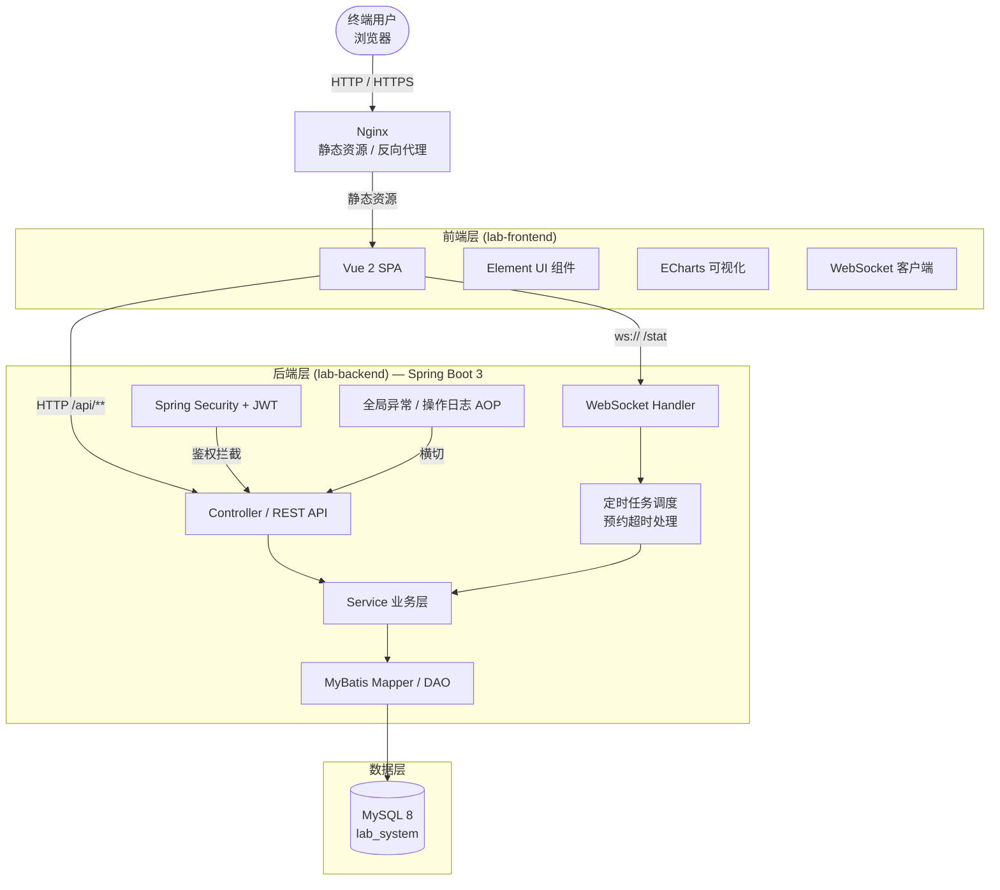
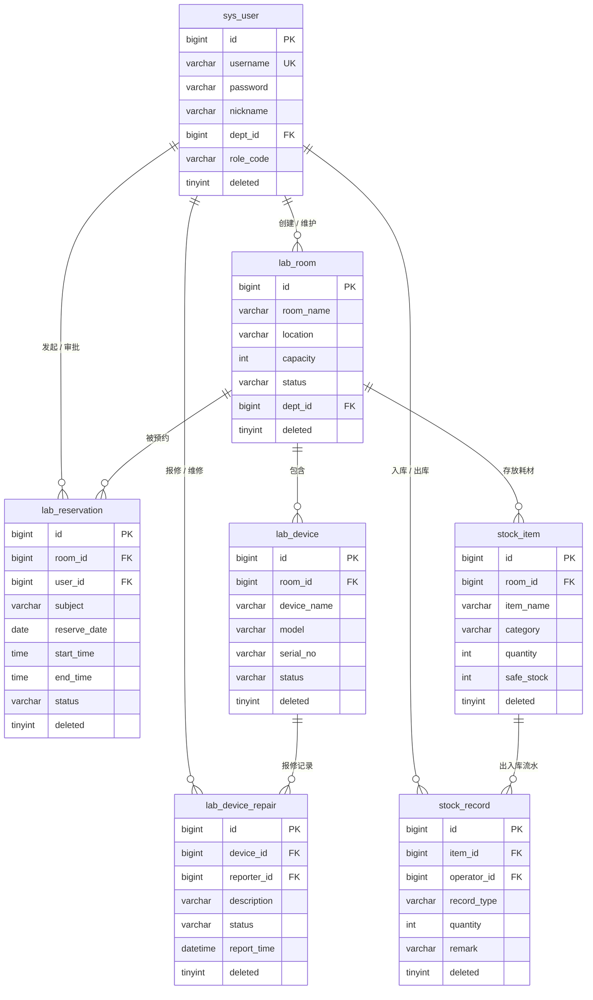

# 实验室资源预约管理系统（Laboratory Resource Reservation System）

> Java EE 实训课程考核项目 · 基于 Spring Boot 3 + Vue 2 前后端分离架构

---

## 一、项目定位

实验室资源预约管理系统是一套面向**高校院系、小微企业办公场地、社区服务中心**等场景的实验室 / 会议室 / 设备资源预约与管理平台，核心解决以下业务痛点：

- 实验室 / 会议室开放时间冲突与人工登记低效；
- 设备台账分散、维修记录难以追踪；
- 耗材进出库无统一台账、库存告警滞后；
- 管理人员缺少实时看板与趋势数据支撑。

系统围绕"**空间 → 设备 → 预约 → 耗材 → 数据**"的完整闭环，提供从资源录入、预约审批、使用记录、耗材流转到统计分析的一站式管理能力。

---

## 二、技术栈

| 分层 | 技术选型 |
| --- | --- |
| 后端框架 | **Spring Boot 3.2** + **Spring Security 6** + **JWT** |
| ORM / 持久层 | **MyBatis**（XML 动态 SQL） |
| 数据库 | **MySQL 8**（InnoDB） |
| 实时通信 | **WebSocket**（Spring WebSocket） |
| 前端框架 | **Vue 2.7** + **Vue Router** + **Vuex** |
| UI 组件库 | **Element UI**（表格 / 弹窗 / 时间选择器） |
| 数据可视化 | **ECharts 5**（柱状图 / 折线图 / 饼图 / 仪表盘） |
| Excel 导入导出 | **Apache POI 5**（HSSF + XSSF） |
| 构建工具 | Maven 3.9 / Node 16 + npm 8 |
| JDK | JDK 17 |

---

## 三、系统架构

### 3.1 整体架构图（B/S 前后端分离）



### 3.2 分层职责

- **前端层**：基于 Vue 2 SPA 单页应用，由 `vue-router` 控制页面路由，`vuex` 维护用户信息与动态菜单权限，`axios` 拦截器统一注入 JWT Token，`WebSocket` 客户端订阅仪表盘实时推送。
- **后端层**：严格遵循 Controller → Service → Mapper 三层结构；通过 `JwtAuthFilter` 完成无状态鉴权；通过 `OperationLogAspect` AOP 切面记录关键操作；通过 `@Scheduled` 定时任务自动处理预约超时。
- **数据层**：MySQL 8 主表共 13 张，覆盖系统、实验室、预约、库存、统计五大业务域，统一使用 `create_time / update_time / deleted` 审计字段与逻辑删除。

---

## 四、核心业务模块（5 大模块）

### 模块 1：实验室管理（Lab Room / Lab Device / Repair）

**原子功能：**
1. **实验室房间 CRUD**：支持按名称、所属部门、容纳人数、状态（开放/维护/关闭）条件查询，录入实验室图片、用途描述、开放时段；支持批量导入（Excel）与导出。
2. **设备台账管理**：设备与实验室多对一关联，记录设备名称、型号、序列号、购入日期、负责人；支持按实验室 / 状态筛选；支持 Excel 批量导入设备清单。
3. **维修记录管理**：支持教师上报设备故障（报修人、故障描述、紧急程度），管理员分派维修并登记维修人、维修时间、费用、备注；支持"我的报修"与"全部维修"双视角。
4. **实验室状态流转**：房间状态在开放 / 维护 / 关闭之间切换，切换时联动关闭进行中的预约，防止脏数据。

### 模块 2：设备台账与维修（见模块 1，与实验室模块深度耦合）

### 模块 3：预约中心（Reservation）

**原子功能：**
1. **发起预约（我的预约）**：选择实验室、选择日期与时间段、填写主题与参会人数；前端做时间冲突校验（同一实验室同一时段不可重复预约），后端二次校验并写入状态"待审核"。
2. **预约审批**：管理员 / 实验室管理员可对"待审核"预约进行通过 / 驳回操作，驳回需填写原因；审批后预约状态变更为"已通过 / 已驳回"。
3. **签到与使用完成**：到预约时间点管理员在"签到检查"页完成签到；使用结束后点击"结束使用"，预约状态标记为"已完成"；未按时签到或结束的预约由定时任务自动标记为"已超时 / 已取消"。
4. **条件查询与分页**：支持按实验室、预约人、状态、日期区间筛选，后端使用 `PageParam / PageResult` 统一分页对象。

### 模块 4：耗材库存管理（Stock Item / Stock Record）

**原子功能：**
1. **耗材物品台账**：记录耗材名称、分类、规格、单位、安全库存、所在实验室；支持按分类筛选、按关键字搜索、按库存量排序。
2. **出入库流水记录**：支持入库 / 出库 / 调拨 / 盘点 4 类单据，记录数量、经办人、备注；出库自动扣减库存并写入流水表；安全库存以下自动告警。
3. **库存告警看板**：基于安全库存阈值计算，在统计看板与"库存预警"页以红色高亮方式展示，Excel 导出库存报表。
4. **Excel 批量导入**：通过 `ExcelImportUtil` 一键导入整批耗材，返回成功数 / 失败数 / 失败行号。

### 模块 5：统计分析与工作台（Stat / Dashboard）

**原子功能：**
1. **首页数据看板**：展示实验室总数、设备总数、待审核预约数、今日预约、本月使用次数等 KPI；展示实验室使用率 Top5、设备故障分类占比饼图。
2. **实验室使用率分析**：按周 / 月维度统计每个实验室预约时长与开放时长之比，以折线图 + 表格方式展示，支持自定义时间区间。
3. **设备故障与维修分析**：按设备、按月份统计故障次数与维修费用，输出柱状图；支持导出 Excel 报表。
4. **WebSocket 实时刷新**：浏览器打开看板后建立 WebSocket 连接，后端在预约状态、库存状态发生变更时主动推送 JSON 消息，前端无刷新更新 KPI 与图表。

---

## 五、模块间数据互通关系（ER 图）



**关键关系解读：**
- `lab_room` ↔ `lab_device` ↔ `lab_device_repair`：一个实验室包含多台设备，一台设备有多条维修记录。
- `lab_room` ↔ `lab_reservation`：实验室被多条预约引用，删除实验室前必须先处理相关预约。
- `lab_room` ↔ `stock_item` ↔ `stock_record`：实验室存放多类耗材，每类耗材有多条出入库流水。
- `sys_user` ↔ 所有业务表：用户作为"创建人 / 操作人 / 预约人 / 报修人"被引用，通过 `deleted` 逻辑删除与数据权限控制数据隔离。

---

## 六、角色权限体系

| 角色 | role_code | 权限范围 | 典型用户 |
| --- | --- | --- | --- |
| **超级管理员** | `ADMIN` | 所有模块、所有数据；可新增用户、分配角色、查看全部日志、管理部门与菜单 | 院级系统管理员 |
| **实验室管理员** | `LAB_ADMIN` | 可管理本部门实验室、设备、维修；可审批本部门预约；可查看本部门库存与统计 | 实验室主任 / 实验员 |
| **教师** | `TEACHER` | 可发起预约、查看自己的预约历史；可上报设备故障；可查看本部门实验室信息 | 授课教师 / 研究员 |
| **学生** | `STUDENT` | 可发起预约（部分系统限制为仅开放时段）、查看自己预约记录与状态 | 本科生 / 研究生 |

**权限控制手段：**
1. 前端按钮级权限：通过 `v-permission` 指令 + Vuex `permission` 模块控制新增 / 编辑 / 删除 / 审批按钮显隐。
2. 后端 URL 级权限：`SecurityConfig` 按 `role_code` 拦截不同 API 路径。
3. **数据权限隔离**：`DataScopeUtil` 根据当前用户 `dept_id` 自动拼接 `WHERE dept_id IN (...)`，非管理员只能查看本部门数据。

---

## 七、项目目录结构

```
lab-system/
├── lab-backend/                 # 后端工程 (Spring Boot 3)
│   ├── src/main/java/com/lab/
│   │   ├── common/              # 通用工具：Result、Page、异常、Excel、SQL Like
│   │   ├── config/              # 配置类：Cors、Cache、AOP、版本
│   │   ├── module/
│   │   │   ├── lab/             # 实验室 / 设备 / 维修
│   │   │   ├── reserve/         # 预约 + 超时定时任务
│   │   │   ├── stock/           # 耗材 / 出入库
│   │   │   ├── stat/            # 统计与看板
│   │   │   └── system/          # 用户 / 角色 / 部门 / 菜单 / 日志 / 鉴权
│   │   ├── security/            # JWT + Spring Security + 数据权限
│   │   └── websocket/           # 实时推送
│   ├── src/main/resources/
│   │   ├── mapper/              # MyBatis XML
│   │   └── application.yml      # 主配置
│   ├── src/test/java/           # JUnit 单元测试
│   └── pom.xml
│
├── lab-frontend/                # 前端工程 (Vue 2 + Element UI)
│   ├── src/
│   │   ├── api/                 # axios API 封装
│   │   ├── components/          # DataTable / FormDialog / SearchBar ...
│   │   ├── directives/          # v-permission 权限指令
│   │   ├── layout/              # 主框架 + 动态侧边栏
│   │   ├── router/              # 路由 + 守卫
│   │   ├── store/               # Vuex user / permission
│   │   ├── utils/               # request / auth / permission / websocket / echarts
│   │   └── views/               # 18 个页面：登录 / 注册 / dashboard / 各业务页
│   ├── public/index.html
│   ├── vue.config.js
│   └── package.json
│
├── sql/
│   ├── lab_system.sql           # 建表 + 菜单 + 角色 + 默认账号
│   └── demo_data.sql            # 演示数据（可选）
│
└── docs/
    ├── CODE_WIKI.md             # 开发规范
    ├── TEST_PLAN.md             # 测试计划
    └── 启动与验收指南.md         # 课程验收流程
```

---

## 八、快速启动指南（3 步）

### 前置依赖

| 依赖 | 推荐版本 |
| --- | --- |
| JDK | 17 |
| Maven | 3.8+ |
| MySQL | 8.0+ |
| Node.js | 16.x |
| npm | 8.x |

---

### 第 1 步：初始化数据库

```bash
# 1. 使用 MySQL 客户端或命令行登录
mysql -u root -p

# 2. 创建数据库
CREATE DATABASE lab_system DEFAULT CHARACTER SET utf8mb4 COLLATE utf8mb4_general_ci;

# 3. 执行建表脚本与默认数据
USE lab_system;
SOURCE c:/Users/12980/Desktop/lab-system/sql/lab_system.sql;

# 4. （可选）导入演示数据，便于直接体验
SOURCE c:/Users/12980/Desktop/lab-system/sql/demo_data.sql;
```

然后编辑 `lab-backend/src/main/resources/application.yml`，将数据库账号密码改为本机配置：

```yaml
spring:
  datasource:
    url: jdbc:mysql://localhost:3306/lab_system?useUnicode=true&characterEncoding=utf8&serverTimezone=Asia/Shanghai
    username: root
    password: your_password
```

---

### 第 2 步：启动后端（Spring Boot）

```bash
cd lab-backend

# 方式 A：Maven 插件启动（推荐开发期）
mvn spring-boot:run

# 方式 B：打包后运行 jar
mvn clean package -DskipTests
java -jar target/lab-backend-1.0.0.jar
```

启动成功标志：控制台看到 `LabBackendApplication started`，并输出 Swagger / 接口日志。
后端默认监听端口：**8080**，API 前缀：`/api/v1`。

---

### 第 3 步：启动前端（Vue 2）

```bash
cd lab-frontend

# 安装依赖（首次运行 / 切换依赖时）
npm install

# 开发模式启动，带热更新
npm run serve
```

启动成功后访问：

- 登录页：<http://localhost:9528/login>
- 注册页：<http://localhost:9528/register>
- 首页看板：登录后自动跳转 <http://localhost:9528/dashboard>

生产构建：

```bash
npm run build
# 产物在 lab-frontend/dist/，可部署至 Nginx
```

---

## 九、系统特色亮点

| 亮点 | 说明 |
| --- | --- |
| **数据权限隔离** | `DataScopeUtil` 基于 `dept_id` 自动拼接过滤条件，教师 / 学生仅能操作本部门数据 |
| **WebSocket 实时刷新** | 打开看板后建立长连接，预约状态、库存告警变化即时推送，无需手动刷新 |
| **超时自动处理** | `ReservationTimeoutService` 基于 `@Scheduled` 定时扫描"未签到 / 未结束"预约并自动置为超时 / 取消 |
| **Excel 导入导出** | `ExcelImportUtil / ExcelExportUtil` 统一封装 POI，支持实验室、设备、耗材、预约批量导入导出 |
| **条件查询分页** | 所有列表页使用 `PageParam(page, size, keyword, filters)` + `PageResult(list, total)`，SQL 使用 `LIMIT` 分页 |
| **逻辑删除** | 所有核心表统一使用 `deleted` 字段，删除接口只做 UPDATE 标记，保留审计数据 |
| **操作日志** | `SysLog` + AOP 切面记录登录、修改、删除、审批、导入等关键操作 |
| **动态侧边栏** | 登录后基于角色 + 菜单表动态生成左侧菜单，`STUDENT` 只看到与自己相关的入口 |

---

## 十、默认账号 / 密码

> 首次执行 `lab_system.sql` 后已内置以下账号，**请在课程验收完成后修改默认密码**。

| 账号 | 密码 | 角色 | 说明 |
| --- | --- | --- | --- |
| `admin` | `123456` | 超级管理员（ADMIN） | 可访问所有页面与所有部门数据 |
| `labadmin` | `123456` | 实验室管理员（LAB_ADMIN） | 管理本部门实验室 / 设备 / 预约 |
| `teacher1` | `123456` | 教师（TEACHER） | 可发起预约、上报维修 |
| `student1` | `123456` | 学生（STUDENT） | 可发起与查看个人预约 |

---

## 十一、页面数量统计

| 分类 | 页面 | 数量 |
| --- | --- | --- |
| **入口页** | 登录页、注册页 | **2** |
| **工作台 / 看板** | 首页 Dashboard | **1** |
| **实验室管理** | 实验室房间、设备台账、维修管理（含"我的报修"） | **4** |
| **预约中心** | 我的预约、预约审批、签到检查 | **3** |
| **耗材库存** | 耗材物品、出入库记录 | **2** |
| **统计分析** | 使用率分析、故障分析、库存预警 | **3** |
| **系统管理** | 用户管理、角色管理、部门管理、系统日志 | **4** |
| **其他** | 404 错误页 | 1 |
| **合计** | 登录 × 1 / 注册 × 1 + 管理页 ≈ 15 + 数据看板 × 1 | **约 18 个页面** |

> 按课程考核口径统计：**约 15 个管理页面 + 1 个数据看板 + 2 个入口页 = 18 个页面**。

---

## 十二、课程项目说明（License / Contact）

- **项目性质**：本项目为 **Java EE 实训课程考核项目**，所有代码与文档仅供课程学习、演示与答辩使用。
- **数据库与素材**：`sql/lab_system.sql` 为实训环境建表脚本，`sql/demo_data.sql` 为课程演示数据，生产环境请清空并替换为实际业务数据。
- **第三方声明**：Vue、Element UI、ECharts、Apache POI、Spring Boot 等均遵循各自开源许可。
- **禁止用途**：不得将本项目直接用于商业发布、敏感数据托管；不得作为课程考核外的正式系统上线。
- **作者 / 联系方式**：本项目由实训小组成员共同完成，问题反馈与代码评审请联系课程指导教师或项目负责人。

```
Copyright © 2025 - 2026 Lab System Course Team.
仅供课程学习与答辩使用，转载请保留本声明。
```

---

**祝实训顺利，答辩高分通过！** 🎓
