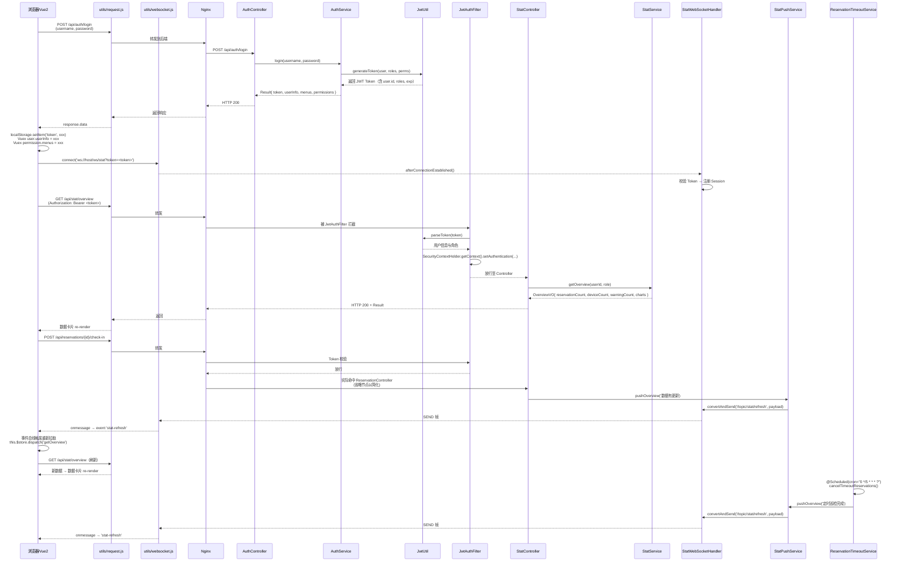

# 实验室资源预约管理系统 —— 角色权限矩阵与系统架构文档

> 文档版本：v1.0（课程考核答辩专用）
> 系统名称：实验室资源预约管理系统（Lab Reservation System）
> 适用场景：高校/科研院所实验室预约、设备报修、耗材库存、统计分析与系统管理一体化平台

---

## 1. 角色定义与代码映射表

系统采用基于角色的访问控制（RBAC），共设计 4 种角色，对应 Spring Security `GrantedAuthority` 的 `role_code`。

| # | 角色 | role_code | 典型账号 | 说明 |
|---|------|-----------|---------|------|
| 1 | 超级管理员 | `ROLE_ADMIN` | `admin` | 全量数据可见 + 系统级配置管理（用户、角色、菜单、部门、日志） |
| 2 | 实验室管理员 | `ROLE_LABADMIN` | `labadmin` | 管理自己负责的实验室及相关设备、预约、耗材、维修数据 |
| 3 | 教师 | `ROLE_TEACHER` | `teacher1` | 预约实验室、提交报修、管理个人申请、查看个人统计 |
| 4 | 学生 | `ROLE_STUDENT` | `student1` | 预约实验室、提交报修、查看个人申请记录 |

> **映射机制**：登录成功后由 `JwtAuthFilter` 从 Token 中解析 `role_code` 列表，写入 `SecurityContextHolder`；Service 层通过 `DataScopeUtil.getDataScope(role_code)` 构造动态 SQL 过滤条件。

---

## 2. 角色 × 页面 × 操作权限矩阵

> 单元格取值：`✅` 可操作（增删改查/审核/导入导出全权限）；`⚠` 仅看自己或仅个人记录；`❌` 无权限。

| 功能模块 | 页面 / 子模块 | 操作 | 超级管理员 | 实验室管理员 | 教师 | 学生 |
|---------|-------------|------|-----------|------------|------|------|
| **实验室管理** | 实验室档案 | 查看列表 | ✅ | ✅（仅自己负责的实验室） | ❌ | ❌ |
|  |  | 条件查询 | ✅ | ✅（仅自己负责的实验室） | ❌ | ❌ |
|  |  | 新增 | ✅ | ❌ | ❌ | ❌ |
|  |  | 修改 | ✅ | ✅（仅自己负责的实验室） | ❌ | ❌ |
|  |  | 删除 | ✅ | ❌ | ❌ | ❌ |
|  |  | 批量删除 | ✅ | ❌ | ❌ | ❌ |
|  |  | 导入 | ✅ | ❌ | ❌ | ❌ |
|  |  | 导出 | ✅ | ✅（仅自己负责的实验室） | ❌ | ❌ |
| **设备与维修管理** | 设备台账 | 查看列表 | ✅ | ✅（自己实验室下设备） | ❌ | ❌ |
|  |  | 条件查询 | ✅ | ✅（自己实验室下设备） | ❌ | ❌ |
|  |  | 新增 | ✅ | ✅（自己实验室下设备） | ❌ | ❌ |
|  |  | 修改 | ✅ | ✅（自己实验室下设备） | ❌ | ❌ |
|  |  | 删除 | ✅ | ❌ | ❌ | ❌ |
|  |  | 批量删除 | ✅ | ❌ | ❌ | ❌ |
|  |  | 导出 | ✅ | ✅（自己实验室下设备） | ❌ | ❌ |
|  | 设备报修 | 查看全部工单 | ✅ | ✅（自己实验室下维修） | ❌ | ❌ |
|  |  | 查看自己的工单 | ❌ | ❌ | ⚠ | ⚠ |
|  |  | 提交报修 | ❌ | ✅（自己实验室下设备） | ✅ | ✅ |
|  |  | 更新状态（维修/关闭） | ✅ | ✅（自己实验室下维修） | ❌ | ❌ |
|  |  | 删除 | ✅ | ❌ | ❌ | ❌ |
| **预约中心** | 预约管理 | 查看全部 | ✅ | ✅（自己实验室下预约） | ❌ | ❌ |
|  |  | 查看自己 | ❌ | ❌ | ⚠ | ⚠ |
|  |  | 条件查询 | ✅ | ✅（自己实验室下预约） | ⚠（仅个人） | ⚠（仅个人） |
|  |  | 提交预约 | ❌ | ✅ | ✅ | ✅ |
|  |  | 审核预约 | ✅ | ✅（自己实验室下预约） | ❌ | ❌ |
|  |  | 签到 | ✅ | ✅（自己实验室下预约） | ⚠（本人预约） | ⚠（本人预约） |
|  |  | 签退 | ✅ | ✅（自己实验室下预约） | ⚠（本人预约） | ⚠（本人预约） |
|  |  | 取消 | ✅ | ✅（自己实验室下预约） | ⚠（本人预约） | ⚠（本人预约） |
|  |  | 删除 | ✅ | ❌ | ❌ | ❌ |
|  |  | 导出 | ✅ | ✅（自己实验室下预约） | ❌ | ❌ |
| **耗材库存** | 耗材档案 | 查看列表 | ✅ | ✅（自己实验室下耗材） | ❌ | ❌ |
|  |  | 条件查询 | ✅ | ✅（自己实验室下耗材） | ❌ | ❌ |
|  |  | 新增 | ✅ | ✅（自己实验室下耗材） | ❌ | ❌ |
|  |  | 修改 | ✅ | ✅（自己实验室下耗材） | ❌ | ❌ |
|  |  | 删除 | ✅ | ❌ | ❌ | ❌ |
|  |  | 导出 | ✅ | ✅（自己实验室下耗材） | ❌ | ❌ |
|  | 出入库记录 | 查看列表 | ✅ | ✅（自己实验室下耗材） | ❌ | ❌ |
|  |  | 入库登记 | ✅ | ✅（自己实验室下耗材） | ❌ | ❌ |
|  |  | 出库登记 | ✅ | ✅（自己实验室下耗材） | ❌ | ❌ |
|  | 库存预警 | 查看预警列表 | ✅ | ✅（自己实验室下耗材） | ❌ | ❌ |
| **统计分析** | 工作台 | 查看（全量） | ✅ | ❌ | ❌ | ❌ |
|  |  | 查看（自己的实验室） | ❌ | ✅ | ❌ | ❌ |
|  |  | 查看（个人数据） | ❌ | ❌ | ✅ | ✅ |
|  | 使用率统计 | 查看 | ✅ | ✅（自己实验室） | ❌ | ❌ |
|  | 故障分布 | 查看 | ✅ | ✅（自己实验室） | ❌ | ❌ |
|  | 库存预警分析 | 查看 | ✅ | ✅（自己实验室） | ❌ | ❌ |
| **系统管理** | 用户管理 | 查看 | ✅ | ❌ | ❌ | ❌ |
|  |  | 新增 | ✅ | ❌ | ❌ | ❌ |
|  |  | 修改 | ✅ | ❌ | ❌ | ❌ |
|  |  | 删除 | ✅ | ❌ | ❌ | ❌ |
|  |  | 批量删除 | ✅ | ❌ | ❌ | ❌ |
|  |  | 重置密码 | ✅ | ❌ | ❌ | ❌ |
|  |  | 导出 | ✅ | ❌ | ❌ | ❌ |
|  | 角色管理 | 查看 | ✅ | ❌ | ❌ | ❌ |
|  |  | 新增 | ✅ | ❌ | ❌ | ❌ |
|  |  | 修改 | ✅ | ❌ | ❌ | ❌ |
|  |  | 删除 | ✅ | ❌ | ❌ | ❌ |
|  |  | 导出 | ✅ | ❌ | ❌ | ❌ |
|  | 菜单管理 | 查看 | ✅ | ❌ | ❌ | ❌ |
|  |  | 新增 | ✅ | ❌ | ❌ | ❌ |
|  |  | 修改 | ✅ | ❌ | ❌ | ❌ |
|  |  | 删除 | ✅ | ❌ | ❌ | ❌ |
|  | 部门管理 | 查看 | ✅ | ❌ | ❌ | ❌ |
|  |  | 新增 | ✅ | ❌ | ❌ | ❌ |
|  |  | 修改 | ✅ | ❌ | ❌ | ❌ |
|  |  | 删除 | ✅ | ❌ | ❌ | ❌ |
|  | 操作日志 | 查看 | ✅ | ❌ | ❌ | ❌ |
|  |  | 导出 | ✅ | ❌ | ❌ | ❌ |

> **注解**：上表同时对应 `sys_menu.perms` 字段（如 `lab:room:list` / `lab:room:add` / `reserve:audit`），前端路由守卫与按钮级 `v-hasPerm` 指令均基于该字段判断。

---

## 3. 数据权限隔离范围矩阵（DataScopeUtil）

| 数据维度 \ 角色 | 超级管理员（ROLE_ADMIN） | 实验室管理员（ROLE_LABADMIN） | 教师（ROLE_TEACHER） | 学生（ROLE_STUDENT） |
|----------------|-----------------------|----------------------------|-------------------|-------------------|
| **实验室列表** | 全量 | 自己管理的实验室（`lab_room.manager_id = 当前用户`） | 无权限 | 无权限 |
| **设备列表** | 全量 | 自己管理实验室下设备（`lab_device.lab_id IN (本人负责的 lab_id)`） | 无权限 | 无权限 |
| **维修记录列表** | 全量 | 自己管理实验室下维修（`device.lab_id IN (本人负责的 lab_id)`） | 个人操作记录（`reporter_id = 当前用户`） | 个人操作记录（`reporter_id = 当前用户`） |
| **预约列表** | 全量 | 自己管理实验室下预约（`lab_reservation.lab_id IN (本人负责的 lab_id)`） | 个人操作记录（`user_id = 当前用户`） | 个人操作记录（`user_id = 当前用户`） |
| **耗材档案与库存** | 全量 | 自己管理实验室下耗材（`stock_item.lab_id IN (本人负责的 lab_id)`） | 无权限 | 无权限 |
| **统计数据** | 全量 | 自己管理的实验室维度聚合 | 个人预约/报修汇总 | 个人预约/报修汇总 |
| **用户数据** | 全量 | 无权限 | 仅本人基本信息 | 仅本人基本信息 |

> **实现方式**：`DataScopeUtil` 根据当前登录用户 `role_code` + `userId` 注入 `SQL 片段`（例如 `AND manager_id = #{uid}` 或 `AND lab_id IN (SELECT id FROM lab_room WHERE manager_id = #{uid})`），通过 MyBatis 拦截器拼接到底层 Mapper。

---

## 4. 系统分层架构（后端）

```mermaid
graph TB
    Browser[浏览器 / Vue2 + ElementUI]
    Nginx[Nginx 反向代理<br/>静态资源分发 + HTTPS]
    SB[Spring Boot 3 应用服务器]

    Browser -->|HTTP + JWT Authorization| Nginx
    Nginx -->|反向代理 8080| SB

    subgraph Controller层
        C1[AuthController<br/>/api/auth/login /logout]
        C2[LabRoomController<br/>/api/lab/rooms]
        C3[DeviceController<br/>/api/lab/devices]
        C4[RepairController<br/>/api/lab/repairs]
        C5[ReservationController<br/>/api/reservations]
        C6[StockItemController<br/>/api/stock/items]
        C7[StockRecordController<br/>/api/stock/records]
        C8[StatController<br/>/api/stat/overview /charts]
        C9[UserController<br/>/api/system/users]
        C10[RoleController<br/>/api/system/roles]
        C11[MenuController<br/>/api/system/menus]
        C12[LogController<br/>/api/system/logs]
    end

    subgraph Service层[Service 业务层]
        S1[AuthService<br/>login() / verifyToken()]
        S2[LabRoomService<br/>list() / save() / update()]
        S3[DeviceService<br/>listDevices() / addDevice()]
        S4[RepairService<br/>submitRepair() / updateStatus()]
        S5[ReservationService<br/>reserve() / audit() / checkIn()]
        S6[StockItemService]
        S7[StockRecordService]
        S8[StatService<br/>getOverview() / getCharts()]
        S9[UserService<br/>addUser() / resetPwd()]
        S10[RoleService]
        S11[MenuService]
        S12[LogService]
    end

    subgraph Security层[Security & 数据权限层]
        SEC1[JwtAuthFilter<br/>Token 解析]
        SEC2[SecurityConfig<br/>HttpSecurity 规则]
        SEC3[JwtUtil<br/>generateToken() / parseToken()]
        SEC4[DataScopeUtil<br/>getDataScope()]
        SEC5[UserDetailsServiceImpl]
        SEC6[PasswordEncoder<br/>BCrypt]
    end

    subgraph WebSocket层[WebSocket 实时层]
        WS1[StatPushService<br/>pushOverview()]
        WS2[StatWebSocketHandler<br/>handleTextMessage()]
    end

    subgraph Scheduled层[定时任务层]
        T1[ReservationTimeoutService<br/>@Scheduled(cron="0 */5 * * * ?")<br/>cancelTimeoutReservations()]
    end

    subgraph AOP层[AOP 切面]
        A1[OperationLogAspect<br/>@Around(@annotation(OperationLog))]
    end

    subgraph Mapper层[MyBatis Mapper 层]
        M1[UserMapper + XML<br/>selectListPage / insert]
        M2[RoleMapper + XML]
        M3[MenuMapper + XML]
        M4[LabRoomMapper + XML]
        M5[DeviceMapper + XML]
        M6[RepairMapper + XML]
        M7[ReservationMapper + XML]
        M8[StockItemMapper + XML]
        M9[StockRecordMapper + XML]
        M10[LogMapper + XML]
        M11[StatMapper + XML<br/>聚合 SQL]
        M12[DeptMapper + XML]
    end

    subgraph 数据层
        DB[(MySQL 8<br/>13 张表)]
        CACHE[(Redis<br/>可选：Token 黑名单 / 缓存)]
    end

    subgraph 通用工具层
        U1[Result<T><br/>统一响应]
        U2[PageResult<T><br/>分页封装]
        U3[ExcelImportUtil<br/>Apache POI]
        U4[ExcelExportUtil]
    end

    SB --> C1 & C2 & C3 & C4 & C5 & C6 & C7 & C8 & C9 & C10 & C11 & C12

    C1 --> S1
    C2 --> S2
    C3 --> S3
    C4 --> S4
    C5 --> S5
    C6 --> S6
    C7 --> S7
    C8 --> S8
    C9 --> S9
    C10 --> S10
    C11 --> S11
    C12 --> S12

    SB --> SEC1
    SEC1 --> SEC3
    SEC1 --> SEC5
    SEC2 --> SEC6
    SEC2 -.->|配置规则| SB

    S2 & S3 & S4 & S5 & S6 & S7 & S8 --> SEC4

    SB --> WS1 & WS2
    WS1 -->|写入通道| WS2
    WS2 -->|SimpMessagingTemplate| Browser

    SB --> T1
    T1 -->|调用| S5

    A1 -->|环绕拦截| C1 & C2 & C3 & C4 & C5 & C6 & C7 & C8 & C9 & C10 & C11 & C12
    A1 -->|写入日志| S12

    S1 --> M1
    S2 --> M4
    S3 --> M5
    S4 --> M6
    S5 --> M7
    S6 --> M8
    S7 --> M9
    S8 --> M11
    S9 --> M1
    S10 --> M2
    S11 --> M3
    S12 --> M10

    M1 & M2 & M3 & M4 & M5 & M6 & M7 & M8 & M9 & M10 & M11 & M12 --> DB

    SEC3 -.可选.-> CACHE
    S8 -.可选.-> CACHE

    C1 & C2 & C3 & C4 & C5 & C6 & C7 & C8 & C9 & C10 & C11 & C12 --> U1
    C1 & C2 & C3 & C4 & C5 & C6 & C7 & C8 & C9 & C10 & C11 & C12 --> U2
    S2 & S3 & S9 -.调用.-> U3
    S2 & S3 & S9 -.调用.-> U4
```

> **分层说明**：请求自顶向下逐层调用；数据权限由 `DataScopeUtil` 在 Service 层注入 `SQL 片段`，再由 Mapper 层拼接到实际查询；操作日志由 `OperationLogAspect` 切面在 Controller 层透明记录；定时任务与 WebSocket 推送形成两条"异步通道"。

---

## 5. 前端工程架构

```mermaid
graph TB
    Client[浏览器]

    subgraph Vue2应用[Vue 2 SPA 应用]
        MAIN[main.js<br/>入口 / 注册全局组件]
        APP[App.vue<br/>根组件 / 路由视图]
    end

    subgraph Router层[路由与守卫]
        R1[router/index.js<br/>动态路由表]
        R2[router-guards.js<br/>beforeEach: 鉴权 + 权限过滤]
    end

    subgraph Store层[Vuex 状态管理]
        V1[store/index.js<br/>Store 实例]
        V2[store/modules/user.js<br/>userInfo / token / roles]
        V3[store/modules/permission.js<br/>addRoutes / menus]
    end

    subgraph Layout层[Layout 布局组件]
        L1[layout/Layout.vue<br/>Shell 主框架]
        L2[layout/Sidebar.vue<br/>动态菜单 sidebar]
        L3[layout/Navbar.vue<br/>顶部用户/退出]
        L4[layout/AppMain.vue<br/><router-view>]
    end

    subgraph Views层[页面视图]
        P1[views/auth/Login.vue]
        P2[views/dashboard/Dashboard.vue<br/>工作台 / 数据卡片]
        P3[views/lab/LabRoomList.vue]
        P4[views/lab/DeviceList.vue]
        P5[views/lab/RepairList.vue]
        P6[views/reserve/ReservationList.vue]
        P7[views/stock/StockItemList.vue]
        P8[views/stock/StockRecordList.vue]
        P9[views/stat/UsageStat.vue]
        P10[views/stat/RepairStat.vue]
        P11[views/stat/StockStat.vue]
        P12[views/system/UserList.vue]
        P13[views/system/RoleList.vue]
        P14[views/system/MenuList.vue]
        P15[views/system/DeptList.vue]
        P16[views/system/LogList.vue]
    end

    subgraph Components层[通用组件]
        CP1[components/DataTable.vue<br/>el-table + 分页]
        CP2[components/SearchBar.vue]
        CP3[components/PageShell.vue]
        CP4[components/FormDialog.vue]
    end

    subgraph Directive层[权限指令]
        D1[directives/permission.js<br/>v-hasPerm('lab:room:add')]
    end

    subgraph API层[API 封装层]
        A1[api/auth.js]
        A2[api/lab.js]
        A3[api/reserve.js]
        A4[api/stock.js]
        A5[api/stat.js]
        A6[api/system.js]
    end

    subgraph Utils层[工具层]
        U1[utils/request.js<br/>Axios 拦截器 / Authorization 注入]
        U2[utils/websocket.js<br/>connect() / onmessage]
        U3[utils/auth.js<br/>token 读写 localStorage]
        U4[utils/permission.js<br/>checkPerm()]
    end

    Client -->|加载 index.html| MAIN
    MAIN --> APP
    APP -->|<router-view>| L1
    L1 --> L2 & L3 & L4
    L4 -->|动态路由渲染| P1 & P2 & P3 & P4 & P5 & P6 & P7 & P8 & P9 & P10 & P11 & P12 & P13 & P14 & P15 & P16

    MAIN --> R1
    R1 --> R2
    R2 -->|调用| V3
    MAIN --> V1
    V1 --> V2 & V3
    V2 -.写入.-> U3

    P2 & P3 & P4 & P5 & P6 & P7 & P8 & P9 & P10 & P11 & P12 & P13 & P14 & P15 & P16 --> CP1 & CP2 & CP3 & CP4
    P2 & P3 & P4 & P5 & P6 & P7 & P8 & P9 & P10 & P11 & P12 & P13 & P14 & P15 & P16 --> D1

    P1 --> A1
    P3 & P4 & P5 --> A2
    P6 --> A3
    P7 & P8 --> A4
    P2 & P9 & P10 & P11 --> A5
    P12 & P13 & P14 & P15 & P16 --> A6

    A1 & A2 & A3 & A4 & A5 & A6 --> U1
    P2 --> U2
```

> **要点**：路由守卫 `router-guards.js` 会在每次跳转前读取 Vuex 中 `permission.menus` 动态生成路由（避免越权访问页面）；按钮级 `v-hasPerm` 指令从 Vuex 中读取 `user.permissions` 做细粒度隐藏；`utils/request.js` 统一为每次请求注入 `Authorization: Bearer <token>`。

---

## 6. 前后端接口契约 —— 典型完整流程（登录 → Token → WebSocket 实时刷新）



> **接口字段示例**：
> - `POST /api/auth/login` → 入参 `{ username: "admin", password: "123456" }`
> - `POST /api/auth/login` → 出参 `{ code: 200, message: "success", data: { token: "eyJhbGci...", userInfo: {...}, menus: [...], permissions: ["lab:room:list", ...] } } }`
> - `GET /api/stat/overview` → Headers `Authorization: Bearer <token>`
> - WebSocket 消息体 `{ event: "stat-refresh", payload: { updatedAt: "2026-06-20 09:00:00" } }`

---

## 7. 技术选型说明

| 类别 | 选型 | 版本 / 说明 |
|------|------|-------------|
| 后端框架 | Spring Boot | 3.x（Java 17+） |
| ORM 框架 | MyBatis | 原生 XML + 注解混用（便于手写复杂 SQL 与数据权限动态片段） |
| 数据库 | MySQL | 8.x（utf8mb4 / InnoDB） |
| 认证与鉴权 | JWT + Spring Security | jjwt 库生成与解析 Token；Spring Security 管理会话与权限 |
| 前端框架 | Vue.js | 2.6.x |
| UI 组件库 | Element UI | 最新 2.x（`el-table` / `el-form` / `el-dialog` 为主） |
| 状态管理 | Vuex | 集中管理 `user` + `permission` 两个模块 |
| 构建工具（后端） | Maven | `pom.xml` 管理依赖 |
| 构建工具（前端） | Vue CLI + npm | `vue.config.js` / `.env.development` / `.env.production` |
| 实时通信 | WebSocket | Spring WebSocket 原生支持（`TextWebSocketHandler` + `WebSocketConfigurer`） |
| 定时任务 | Spring Scheduled | `@Scheduled(cron = "0 */5 * * * ?")` 每 5 分钟检查超时预约 |
| AOP | Spring AOP | `@Aspect` + `@Around(@annotation(OperationLog))` 记录操作日志 |
| Excel 处理 | Apache POI | 封装为 `ExcelImportUtil` / `ExcelExportUtil`（支持 .xlsx） |
| 密码加密 | BCrypt | Spring Security `PasswordEncoder` 接口 |
| 可选缓存 | Redis | Token 黑名单 / 热点统计数据缓存（课程项目可选用） |
| IDE 推荐 | IntelliJ IDEA / VS Code | 后端 IDEA（Spring 插件）、前端 VS Code（Vetur） |

---

## 8. 数据库表汇总

| # | 表名 | 所属模块 | 关键字段 | 说明 |
|---|------|---------|---------|------|
| 1 | `sys_user` | 系统管理 | `id, username, password(BCrypt), dept_id, status, deleted, create_time` | 用户表（软删除 deleted=1） |
| 2 | `sys_role` | 系统管理 | `id, role_code, role_name, remark, deleted` | 角色表（`ROLE_ADMIN` 等） |
| 3 | `sys_user_role` | 系统管理 | `user_id, role_id` | 用户-角色中间表（支持多角色） |
| 4 | `sys_menu` | 系统管理 | `id, name, path, component, parent_id, perms, order_num, type(M/C/F), deleted` | 菜单/权限表（目录 M / 菜单 C / 按钮 F） |
| 5 | `sys_role_menu` | 系统管理 | `role_id, menu_id` | 角色-菜单中间表 |
| 6 | `sys_dept` | 系统管理 | `id, name, parent_id, order_num, deleted` | 部门表（树形结构） |
| 7 | `sys_log` | 系统管理 | `id, username, module, operation, method, params, ip, time, deleted` | 操作日志表 |
| 8 | `lab_room` | 实验室管理 | `id, name, location, capacity, manager_id, status(开放1/维护2/关闭3), deleted` | 实验室表，`manager_id` 关联 `sys_user.id` 用于数据权限 |
| 9 | `lab_device` | 设备台账 | `id, name, lab_id, model, serial_no, status(在用1/维修2/报废3), deleted` | 设备表 |
| 10 | `lab_device_repair` | 设备维修 | `id, device_id, reporter_id, fault_desc, status(待处理1/维修中2/已完成3/已关闭4), report_time, handle_time, deleted` | 维修记录表 |
| 11 | `lab_reservation` | 预约中心 | `id, user_id, lab_id, start_time, end_time, purpose, status(待审核1/已通过2/已签到3/已签退4/已取消5/已拒绝6), deleted` | 预约表（核心业务表） |
| 12 | `stock_item` | 耗材库存 | `id, name, lab_id, quantity, warning_threshold, unit, deleted` | 耗材档案表，低于 `warning_threshold` 触发预警 |
| 13 | `stock_record` | 耗材库存 | `id, item_id, type(入库1/出库2), quantity, operator_id, remark, record_time` | 出入库记录表 |

> **表结构要点**：所有业务表均采用 `deleted` 字段实现软删除；角色表与菜单表通过中间表解耦；`lab_room.manager_id` 是"实验室管理员"数据权限的关键外键。

---

## 9. 代码文件规模统计

| 层 | 文件数量 | 典型文件 |
|---|---------|---------|
| **Java 后端** | 约 70 个 `.java` 文件 | 12 个 `*Controller` / 12 个 `*Service` + 接口 / 12 个 `*Mapper` / 6 个 Security 类（`JwtAuthFilter` / `SecurityConfig` / `JwtUtil` / `DataScopeUtil` / `UserDetailsServiceImpl` / `PasswordEncoder`）/ 4 个 Config 类（`DataSourceConfig` / `MyBatisConfig` / `WebSocketConfig` / `WebMvcConfig`）/ `OperationLogAspect` / `ReservationTimeoutService` / `StatPushService` / `StatWebSocketHandler` / `Result` / `PageResult` / `ExcelImportUtil` / `ExcelExportUtil` / 各模块 VO / DTO |
| **MyBatis XML** | 约 12 个 `.xml` 文件 | `UserMapper.xml` / `RoleMapper.xml` / `MenuMapper.xml` / `LabRoomMapper.xml` / `DeviceMapper.xml` / `RepairMapper.xml` / `ReservationMapper.xml` / `StockItemMapper.xml` / `StockRecordMapper.xml` / `LogMapper.xml` / `StatMapper.xml` / `DeptMapper.xml` |
| **Vue 前端** | 约 25 个 `.vue` 文件 + 约 20 个 `.js` 文件 | 16 个视图页面（Login / Dashboard / LabRoom / Device / Repair / Reservation / StockItem / StockRecord / UsageStat / RepairStat / StockStat / User / Role / Menu / Dept / Log）/ 4 个通用组件（`DataTable` / `SearchBar` / `PageShell` / `FormDialog`）/ 6 个 API 模块（`auth.js` / `lab.js` / `reserve.js` / `stock.js` / `stat.js` / `system.js`）/ 路由 `router/index.js` + `router-guards.js` / Vuex `store/*` / `utils/request.js` / `utils/websocket.js` / `utils/auth.js` / `utils/permission.js` / `directives/permission.js` / `main.js` / `App.vue` |
| **数据库脚本** | 2 个 `.sql` 文件 | `lab_system.sql`（13 张表结构 + 索引）/ `demo_data.sql`（初始账号 admin/labadmin/teacher1/student1 + 演示数据） |
| **配置文件** | 约 5 个 | `pom.xml`（Maven 依赖）/ `application.yml`（端口/数据源/JWT/WebSocket/定时任务）/ `vue.config.js`（代理与构建配置）/ `.env.development` / `.env.production` |

---

> **答辩提示**：本章档可作为课程考核答辩的架构说明。在答辩时建议结合以下三条主线展开：
> 1. **权限主线**：`sys_role.role_code` → `DataScopeUtil` → Mapper 动态 SQL；
> 2. **业务主线**：`ReservationController` → `ReservationService.audit()` → Mapper 状态机流转；
> 3. **实时主线**：定时任务 / 写操作 → `StatPushService` → WebSocket → 前端 `Dashboard` 刷新。
