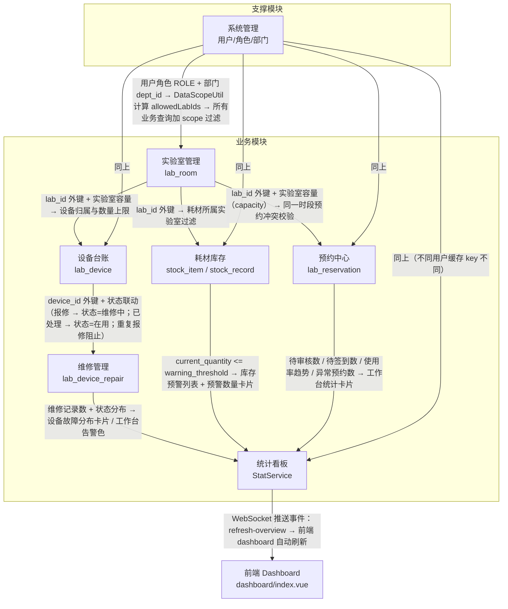
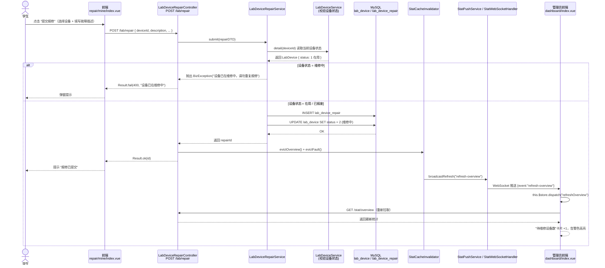
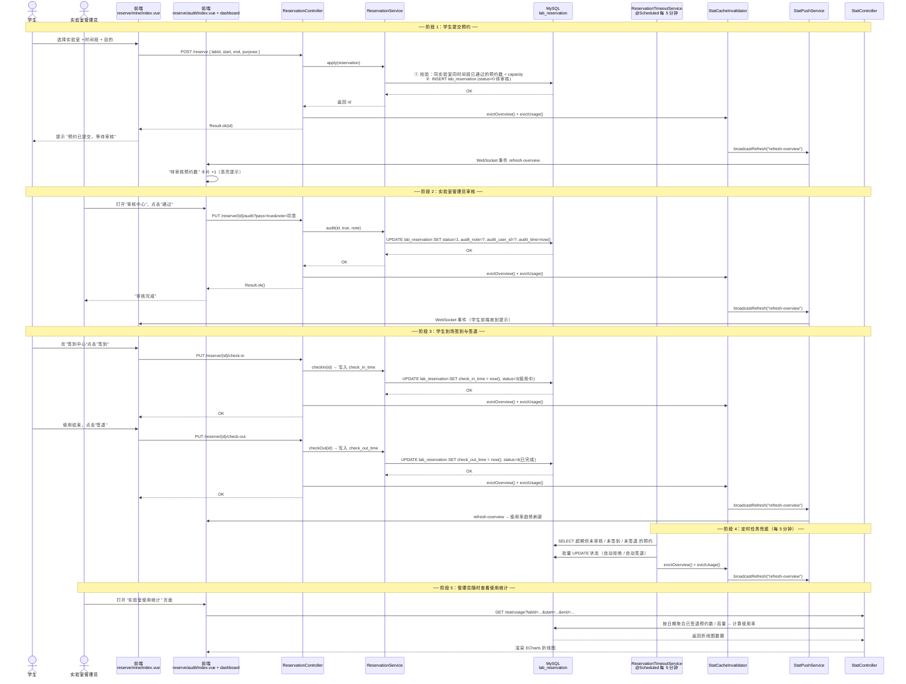

# 模块说明与数据互通文档

> 适用场景：课程考核答辩、模块验收报告、跨模块联调说明
> 系统定位：实验室资源预约管理系统（Lab-Resource-Reservation-System）
> 技术栈：Vue2 + Element UI + Spring Boot + MyBatis + MySQL + WebSocket

---

## 1. 模块划分总览

| 模块编号 | 模块名称               | 核心表（Entity）                              | 关键功能数 | 是否含数据导出 | 后端代码包路径                | 前端页面路径                                    |
| -------- | ---------------------- | --------------------------------------------- | ---------- | -------------- | ----------------------------- | ----------------------------------------------- |
| M01      | 实验室管理             | `lab_room`                                    | 5          | ✗              | `module/lab`                  | `src/views/lab/room/index.vue`                  |
| M02      | 设备台账与维修管理     | `lab_device`, `lab_device_repair`             | 6          | ✔（设备）       | `module/lab`                  | `src/views/lab/device/index.vue`<br>`src/views/lab/repair/index.vue`<br>`src/views/lab/repair/mine/index.vue` |
| M03      | 预约中心               | `lab_reservation`                             | 8          | ✗              | `module/reserve`              | `src/views/reserve/audit/index.vue`<br>`src/views/reserve/check/index.vue`<br>`src/views/reserve/mine/index.vue` |
| M04      | 耗材出入库             | `stock_item`, `stock_record`                  | 5          | ✗              | `module/stock`                | `src/views/stock/item/index.vue`<br>`src/views/stock/record/index.vue` |
| M05      | 统计分析与工作台       | stat 聚合（跨表查询，无独立实体）             | 4          | ✗              | `module/stat`                 | `src/views/dashboard/index.vue`<br>`src/views/stat/fault/index.vue`<br>`src/views/stat/stock-warning/index.vue`<br>`src/views/stat/usage/index.vue` |
| M06      | 系统管理（支撑模块）   | `sys_user`, `sys_role`, `sys_menu`, `sys_dept`, `sys_log` | 5 | ✗ | `module/system` | `src/views/system/user/index.vue`<br>`src/views/system/role/index.vue`<br>`src/views/system/dept/index.vue`<br>`src/views/system/log/index.vue` |

**说明：**

- 关键功能数以 "原子功能清单" 中列出的子功能为准。
- 数据导出仅设备模块提供 Excel 导出（`GET /lab/device/export`），其他模块可通过复制表记录或数据库备份完成。
- 模块 M05 为 "统计聚合模块"，不持有独立业务表，其数据均来自 M01~M04 的跨表 JOIN 与汇总，并通过 `StatCacheInvalidator` 使缓存失效，由 `StatPushService` 主动推送至前端 WebSocket。
- 模块 M06 为系统支撑，提供用户、角色、菜单、部门、日志 5 个子功能，是其他 5 个业务模块的数据权限与认证入口。

---

## 2. 模块原子功能清单

### 2.1 模块一：实验室管理（lab_room）

**模块职责**：维护实验室基础档案，含位置、容量、部门归属、管理员绑定等信息。实验室数据是设备、预约、耗材三个业务模块的"根数据"。

#### 原子功能 1.1：实验室档案增删改查

| 项             | 说明                                                                 |
| -------------- | -------------------------------------------------------------------- |
| 入口页面       | `src/views/lab/room/index.vue`                                       |
| 后端 Controller | `com.lab.module.lab.controller.LabRoomController`                     |
| 入口方法       | `Result<Long> create(@RequestBody LabRoom r)` / `Result<?> update(@RequestBody LabRoom r)` / `Result<PageResult<LabRoom>> page(...)` / `Result<?> delete(@PathVariable Long id)` |
| Service 类     | `com.lab.module.lab.service.LabRoomService`                          |
| 涉及表         | `lab_room`                                                           |
| 数据互通       | 新建/更新后通过 `StatCacheInvalidator.evictOverview() + evictUsage()` 清除统计缓存，触发 M05 统计看板刷新；`lab_room.id` 作为 M02/M03/M04 三个模块的外键 ID |

#### 原子功能 1.2：实验室条件查询与筛选（名称/位置/状态/管理员）

| 项             | 说明                                                                 |
| -------------- | -------------------------------------------------------------------- |
| 入口页面       | `src/views/lab/room/index.vue`（`SearchBar` 组件多条件查询）         |
| Controller 方法 | `Result<PageResult<LabRoom>> page(int pageNum, int pageSize, String keyword, Long deptId, Integer status)` |
| Service 方法   | `PageResult<LabRoom> page(int, int, String, Long, Integer)`          |
| 涉及表         | `lab_room` + 关联 `sys_user`（管理员姓名）                           |
| 数据互通       | 为 M03 "预约申请"、M02 "设备台账" 提供实验室下拉数据源（`GET /lab/room/all`）；数据权限由 `DataScopeUtil.getLabIdsForLabAdmin()` 控制 |

#### 原子功能 1.3：实验室批量导入（Excel）

| 项             | 说明                                                                 |
| -------------- | -------------------------------------------------------------------- |
| 入口页面       | `src/views/lab/room/index.vue`（顶部工具栏"批量导入"按钮）           |
| Controller 方法 | 同模块导入逻辑（参考 M02 设备导入方式，`ExcelImportUtil` 统一实现）  |
| Service 方法   | `LabRoomService.importRooms(InputStream)`                            |
| 涉及表         | `lab_room`                                                           |
| 数据互通       | 导入成功后触发 M05 统计缓存失效；导入后立即在实验室下拉、预约选择处可用 |

#### 原子功能 1.4：实验室管理员绑定

| 项             | 说明                                                                 |
| -------------- | -------------------------------------------------------------------- |
| 入口页面       | `src/views/lab/room/index.vue`（新增/编辑时选择 `managerId`）         |
| Controller 方法 | `create(...)` / `update(...)` 内部联动 `SysUserService.assignRole(userId, "ROLE_LABADMIN")` |
| Service 方法   | `LabRoomService.create()` → 绑定 `manager_id` + 自动分配 `ROLE_LABADMIN` |
| 涉及表         | `lab_room`, `sys_user`, `sys_user_role`                              |
| 数据互通       | 创建实验室时同时在 M06 系统管理模块为指定用户授予实验室管理员角色；绑定后该用户在 M03/M02/M04 的数据范围通过 `DataScopeUtil.getLabIdsForLabAdmin()` 被限制到自己管理的实验室 |

---

### 2.2 模块二：设备台账与维修管理（lab_device + lab_device_repair）

**模块职责**：维护设备台账档案、设备状态流转、维修工单提交与处理。设备与实验室通过 `lab_device.lab_id` 外键关联。

#### 原子功能 2.1：设备台账增删改查

| 项             | 说明                                                                 |
| -------------- | -------------------------------------------------------------------- |
| 入口页面       | `src/views/lab/device/index.vue`                                     |
| Controller 类  | `com.lab.module.lab.controller.LabDeviceController`                  |
| 入口方法       | `Result<Long> create(@RequestBody LabDevice d)` / `Result<?> update(@RequestBody LabDevice d)` / `Result<PageResult<LabDevice>> page(...)` / `Result<?> delete(@PathVariable Long id)` |
| Service 类     | `com.lab.module.lab.service.LabDeviceService`                        |
| 涉及表         | `lab_device`                                                         |
| 数据互通       | `lab_id` 外键绑定 M01；修改后触发 `StatCacheInvalidator.evictFault()`，M05 统计看板的"设备状态分布"卡片刷新 |

#### 原子功能 2.2：设备条件查询（名称/实验室/状态）+ 分页

| 项             | 说明                                                                 |
| -------------- | -------------------------------------------------------------------- |
| 入口页面       | `src/views/lab/device/index.vue`                                     |
| Controller 方法 | `Result<PageResult<LabDevice>> page(int pageNum, int pageSize, String keyword, Long labId, String category, Integer status)` |
| 涉及表         | `lab_device` JOIN `lab_room`（按实验室过滤）                         |
| 数据互通       | 为 M05 "设备故障分布统计" 提供基础过滤条件；查询结果可一键导出为 Excel（`GET /lab/device/export`） |

#### 原子功能 2.3：设备报修与工单管理

| 项             | 说明                                                                 |
| -------------- | -------------------------------------------------------------------- |
| 入口页面       | `src/views/lab/repair/index.vue`（管理员视角）、`src/views/lab/repair/mine/index.vue`（我的报修） |
| Controller 类  | `com.lab.module.lab.controller.LabDeviceRepairController`            |
| 入口方法       | `Result<Long> submit(@RequestBody LabDeviceRepair r)`（提交报修） / `Result<?> handle(@PathVariable Long id, Integer status, String handleNote)`（处理工单） |
| Service 类     | `com.lab.module.lab.service.LabDeviceRepairService`                  |
| 涉及表         | `lab_device_repair` + 联动 `lab_device.status`                       |
| 数据互通       | **关键互通点**：提交报修时会检查设备当前状态——若已为"维修中"则抛出 `BizException`（重复报修阻止）；处理工单完成时同步把 `lab_device.status` 回流到 1（在用）；所有变更触发 M05 统计缓存失效 + WebSocket `refresh-overview` 推送 |

#### 原子功能 2.4：设备状态流转（在用/维修中/已报废）

| 项             | 说明                                                                 |
| -------------- | -------------------------------------------------------------------- |
| 入口页面       | `src/views/lab/device/index.vue`（行内"状态"下拉操作）               |
| Controller 方法 | `Result<?> status(@PathVariable Long id, @PathVariable Integer status)` |
| Service 方法   | `LabDeviceService.status(Long id, Integer status)`                   |
| 涉及表         | `lab_device`                                                         |
| 状态字典       | `1=在用`, `2=维修中`, `3=已报废`                                     |
| 数据互通       | 状态变更直接影响 M05 "设备状态分布卡片"；维修中状态会在工作台以告警色展示；报废设备从设备下拉中过滤 |

---

### 2.3 模块三：预约中心（lab_reservation）

**模块职责**：实验室使用预约的完整生命周期管理——申请→审核→签到→使用→签退。是系统使用频次最高的核心模块。

#### 原子功能 3.1：预约申请

| 项             | 说明                                                                 |
| -------------- | -------------------------------------------------------------------- |
| 入口页面       | `src/views/reserve/mine/index.vue`（顶部"新建预约"按钮）            |
| Controller 类  | `com.lab.module.reserve.controller.ReservationController`            |
| 入口方法       | `Result<Long> apply(@RequestBody Reservation r)`                     |
| Service 方法   | `ReservationService.apply(Reservation r)` —— 内部进行：时间段冲突校验、容量校验、状态初始化（status=0 待审核） |
| 涉及表         | `lab_reservation`                                                    |
| 数据互通       | 通过 `lab_id` 外键关联 M01；申请成功后触发 `StatCacheInvalidator.evictOverview() + evictUsage()`，M05 工作台"待审核预约数"卡片刷新 |

#### 原子功能 3.2：预约审核

| 项             | 说明                                                                 |
| -------------- | -------------------------------------------------------------------- |
| 入口页面       | `src/views/reserve/audit/index.vue`                                 |
| Controller 方法 | `Result<?> audit(@PathVariable Long id, @RequestParam boolean pass, @RequestParam String note)` |
| Service 方法   | `ReservationService.audit(Long id, boolean pass, String note)`       |
| 涉及表         | `lab_reservation`（修改 `status=1 通过` / `status=2 拒绝`，写入 `audit_note`） |
| 数据互通       | **关键互通点**：审核仅允许具有 `ROLE_ADMIN/ROLE_LABADMIN/ROLE_TEACHER` 角色且 `DataScopeUtil.isLabAllowed(lab_id, allowedLabIds)` 为 true 的用户操作；审核通过后的预约进入 "可签到" 状态；审核结果触发 M05 统计看板刷新 |

#### 原子功能 3.3：预约签到与签退

| 项             | 说明                                                                 |
| -------------- | -------------------------------------------------------------------- |
| 入口页面       | `src/views/reserve/check/index.vue`                                 |
| Controller 方法 | `Result<?> checkIn(@PathVariable Long id)` / `Result<?> checkOut(@PathVariable Long id)` |
| Service 方法   | `ReservationService.checkIn(id)` / `checkOut(id)` —— 写入 `check_in_time` / `check_out_time` |
| 涉及表         | `lab_reservation`                                                    |
| 数据互通       | 签到/签退时间影响 M05 "预约使用统计" 的真实使用率计算；签退时触发缓存失效 + WebSocket 推送 |

#### 原子功能 3.4：预约超时自动处理（定时任务）

| 项             | 说明                                                                 |
| -------------- | -------------------------------------------------------------------- |
| 入口           | 后端定时任务，无前端入口                                            |
| 实现类         | `com.lab.module.reserve.service.ReservationTimeoutService`           |
| 触发方式       | `@Scheduled(cron = "0 */5 * * * ?")`（每 5 分钟执行一次）            |
| 处理规则       | ① 超过预约起始时间 30 分钟仍 `status=0`（待审核） → 自动拒绝；② 审核通过但超过预约结束时间未签到 → 标记为"未到"；③ 签到后超过预约结束 60 分钟仍未签退 → 自动签退 |
| 涉及表         | `lab_reservation`                                                    |
| 数据互通       | 每次批量处理后调用 `StatCacheInvalidator.evictOverview() + evictUsage()`，M05 工作台的"异常预约数"与"使用率"随之自动更新 |

#### 原子功能 3.5：我的预约与取消

| 项             | 说明                                                                 |
| -------------- | -------------------------------------------------------------------- |
| 入口页面       | `src/views/reserve/mine/index.vue`                                   |
| Controller 方法 | `Result<PageResult<Reservation>> mine(...)`（按 `user_id=当前用户` 过滤） / `Result<?> cancel(@PathVariable Long id)` |
| Service 方法   | `ReservationService.page(..., userId, ...)` / `cancel(id)`           |
| 涉及表         | `lab_reservation`                                                    |
| 数据互通       | 个人维度过滤保证学生只能看到自己的预约；取消后释放容量，影响 M05 使用率统计 |

---

### 2.4 模块四：耗材出入库（stock_item + stock_record）

**模块职责**：耗材档案管理、出入库登记、库存预警阈值维护。

#### 原子功能 4.1：耗材档案增删改查

| 项             | 说明                                                                 |
| -------------- | -------------------------------------------------------------------- |
| 入口页面       | `src/views/stock/item/index.vue`                                     |
| Controller 类  | `com.lab.module.stock.controller.StockController`                    |
| 入口方法       | `Result<Long> createItem(@RequestBody StockItem item)` / `Result<?> updateItem(...)` / `Result<PageResult<StockItem>> itemPage(...)` / `Result<?> deleteItem(id)` |
| Service 类     | `com.lab.module.stock.service.StockService`                          |
| 涉及表         | `stock_item`                                                         |
| 数据互通       | `stock_item.lab_id` 外键关联 M01；`warning_threshold` 字段为库存预警计算提供阈值 |

#### 原子功能 4.2：耗材出入库登记

| 项             | 说明                                                                 |
| -------------- | -------------------------------------------------------------------- |
| 入口页面       | `src/views/stock/record/index.vue`                                   |
| Controller 方法 | `Result<Long> createRecord(@RequestBody StockRecordDTO dto)`         |
| Service 方法   | `StockService.createRecord(StockRecordDTO dto)` —— 写入 `stock_record` 同时同步更新 `stock_item.current_quantity` |
| 涉及表         | `stock_record`, `stock_item`                                         |
| 数据互通       | 出库操作时若导致 `current_quantity < warning_threshold`，M05 工作台"库存预警"卡片数量自动 +1；出入库记录写入后触发 `StatCacheInvalidator.evictOverview()` |

#### 原子功能 4.3：库存预警

| 项             | 说明                                                                 |
| -------------- | -------------------------------------------------------------------- |
| 入口页面       | `src/views/stat/stock-warning/index.vue`（统计页） + `src/views/dashboard/index.vue`（工作台卡片） |
| 实现方式       | `StatService.getStockWarningList()` 聚合 `stock_item` 中 `current_quantity <= warning_threshold` 的记录 |
| 涉及表         | `stock_item`                                                         |
| 数据互通       | 预警列表同时用于 M05 工作台 "库存预警数量" 卡片 + M05 "库存预警统计" 独立页面；数量变化通过 WebSocket `refresh-overview` 事件主动推送至前端 |

---

### 2.5 模块五：统计分析与工作台（stat 聚合）

**模块职责**：聚合 M01~M04 四大业务模块的数据，以工作台看板、趋势图、故障分布、库存预警四种形式向不同角色呈现。

#### 原子功能 5.1：工作台数据看板

| 项             | 说明                                                                 |
| -------------- | -------------------------------------------------------------------- |
| 入口页面       | `src/views/dashboard/index.vue`（登录后默认首页）                    |
| Controller 类  | `com.lab.module.stat.controller.StatController`                      |
| 入口方法       | `Result<Map<String, Object>> overview()`                              |
| Service 类     | `com.lab.module.stat.service.StatService`                            |
| 聚合查询       | ① 待审核预约数（M03）② 待维修设备数（M02）③ 库存预警数（M04）④ 我的预约数（M03 个人维度）⑤ 最近预约列表（M03）⑥ 最近维修列表（M02）⑦ 设备状态分布（M02） |
| 数据互通       | **关键互通点**：`overview()` 使用 `@Cacheable(value = "stat:overview", key = "T(com.lab.security.DataScopeUtil).currentScopeKey()")` 按用户 scope 缓存；其他模块任何写操作通过 `StatCacheInvalidator.evictOverview()` 使缓存失效；服务端在缓存失效后通过 `StatPushService.broadcastRefresh("refresh-overview")` 向所有在线 WebSocket 客户端推送刷新事件，前端 `utils/websocket.js` 收到后自动调用 `this.$store.dispatch('refreshOverview')` |

#### 原子功能 5.2：设备故障分布统计

| 项             | 说明                                                                 |
| -------------- | -------------------------------------------------------------------- |
| 入口页面       | `src/views/stat/fault/index.vue`（ECharts 柱状图 + 明细表）          |
| Controller 方法 | `Result<List<Map<String, Object>>> faultDistribution(@RequestParam(required = false) String groupBy)` |
| Service 方法   | `StatService.faultDistribution(String groupBy)` —— 支持 `by_lab` 按实验室 / `by_device` 按设备两种聚合维度 |
| 涉及表         | `lab_device_repair` JOIN `lab_device` JOIN `lab_room`                |
| 数据互通       | 数据来源于 M02 模块提交的维修工单；统计结果用于"故障高发实验室识别" |

#### 原子功能 5.3：库存预警统计

| 项             | 说明                                                                 |
| -------------- | -------------------------------------------------------------------- |
| 入口页面       | `src/views/stat/stock-warning/index.vue`                             |
| Controller 方法 | `Result<PageResult<StockItem>> stockWarningPage(...)`                |
| Service 方法   | `StatService.stockWarningPage(int, int, String)`                     |
| 数据互通       | 来自 M04 模块的 `stock_item` 记录；低于阈值以橙色/红色高亮            |

#### 原子功能 5.4：实验室预约使用统计（使用率趋势）

| 项             | 说明                                                                 |
| -------------- | -------------------------------------------------------------------- |
| 入口页面       | `src/views/stat/usage/index.vue`（折线图 + 顶部实验室筛选）           |
| Controller 方法 | `Result<List<Map<String, Object>>> usageTrend(@RequestParam(required=false) Long labId, ...)` |
| Service 方法   | `StatService.usageTrend(Long labId, LocalDate start, LocalDate end)` |
| 涉及表         | `lab_reservation`（按日期聚合 "已签退预约数 / 理论容量" 作为使用率） |
| 数据互通       | 趋势数据依赖 M03 的签退记录；签退 → 缓存失效 → WebSocket 推送 → 图表刷新 的链路保证数据实时性 |

---

### 2.6 模块六（支撑）：系统管理（system）

**模块职责**：用户认证与授权、角色菜单权限、部门组织、操作审计。是整个系统的"权限中枢"。

#### 原子功能 6.1：用户管理

| 项             | 说明                                                                 |
| -------------- | -------------------------------------------------------------------- |
| 入口页面       | `src/views/system/user/index.vue`                                    |
| Controller 类  | `com.lab.module.system.controller.SysUserController`                 |
| 入口方法       | `Result<Long> create(@RequestBody SysUser u)` / `Result<?> update(...)` / `Result<PageResult<SysUser>> page(...)` / `Result<?> changeStatus(id, status)` |
| Service 类     | `com.lab.module.system.service.SysUserService`                       |
| 涉及表         | `sys_user`, `sys_user_role`                                          |
| 数据互通       | 用户创建时通过 `assignRole` 写入 `sys_user_role`；M01 实验室管理绑定管理员时会调用本模块授予 `ROLE_LABADMIN`；用户禁用后各模块不再允许其登录与操作 |

#### 原子功能 6.2：角色与菜单权限

| 项             | 说明                                                                 |
| -------------- | -------------------------------------------------------------------- |
| 入口页面       | `src/views/system/role/index.vue`                                    |
| Controller 类  | `com.lab.module.system.controller.SysRoleController` / `SysMenuController` |
| 入口方法       | `SysRoleController.assignMenus(roleId, menuIds)`                     |
| Service 方法   | `SysRoleService.assignMenus(Long roleId, List<Long> menuIds)`        |
| 涉及表         | `sys_role`, `sys_menu`, `sys_role_menu`                              |
| 数据互通       | 角色-菜单分配结果决定登录后 `store/modules/permission.js` 动态生成的侧边栏与路由白名单；未授权菜单在前端 `directives/permission.js` 指令控制下自动隐藏按钮与路由拦截 |

#### 原子功能 6.3：部门管理（院系/部门）

| 项             | 说明                                                                 |
| -------------- | -------------------------------------------------------------------- |
| 入口页面       | `src/views/system/dept/index.vue`                                    |
| Controller 类  | `com.lab.module.system.controller.SysDeptController`                 |
| 涉及表         | `sys_dept`                                                           |
| 数据互通       | `sys_dept.id` 被 `sys_user.dept_id` 和 `lab_room.dept_id` 引用；教师角色的 `DataScopeUtil.getLabIdsForTeacher()` 通过 `dept_id` 推导出可审核的实验室范围 |

#### 原子功能 6.4：操作日志

| 项             | 说明                                                                 |
| -------------- | -------------------------------------------------------------------- |
| 入口页面       | `src/views/system/log/index.vue`（管理员审计）                       |
| 实现方式       | `com.lab.config.OperationLogAspect` AOP 切面：对所有标注 `@OperationLog` 的方法自动记录操作人与内容；登录/登出由 `AuthService` 手动写入 |
| 涉及表         | `sys_log`                                                            |
| 数据互通       | 日志记录独立保存，不参与业务数据互通，仅用于审计与故障回溯             |

---

## 3. 模块间数据互通关系

以下数据流以 "写操作 → 缓存失效 → WebSocket 推送 → 前端刷新" 的链路为主线，覆盖 5 大业务模块 + 1 支撑模块之间的关键互通点。



**互通链路技术实现要点（给答辩使用）：**

1. **写后缓存失效**：每个业务模块 Controller 写方法末尾显式调用 `StatCacheInvalidator.evictOverview() / evictUsage() / evictFault()`，清空 `stat:overview` 等缓存 key。
2. **按 scope 隔离缓存**：`@Cacheable(key = "T(com.lab.security.DataScopeUtil).currentScopeKey()")` 保证不同角色看到不同缓存切片，不会出现学生看到管理员数据的越权问题。
3. **WebSocket 主动推送**：`StatPushService.broadcastRefresh("refresh-overview")` 在缓存失效后异步向所有在线客户端推送刷新事件；前端 `src/utils/websocket.js` 监听消息并调用 Vuex action 触发 dashboard 重新拉取。
4. **外键 + 业务规则**：M01 的 `lab_id` 是 M02/M03/M04 三模块的"根主键"，所有查询均含 `DataScopeUtil.isLabAllowed()` 校验；M03 的 `ReservationService.apply()` 在插入前校验实验室容量与时间段冲突。

---

## 4. 数据权限隔离机制（DataScopeUtil）

数据权限由 `com.lab.security.DataScopeUtil` 统一实现，采用 **"角色 → scope → SQL WHERE 条件"** 三级架构。核心方法：

```java
public static List<Long> getLabIdsForLabAdmin();   // 自己管理的实验室
public static List<Long> getLabIdsForTeacher();    // 自己学院下的实验室
public static Long       getCurrentDeptId();        // 当前用户所属部门
public static String     currentScopeKey();         // 缓存 key 前缀
public static boolean    isLabAllowed(Long labId, List<Long> allowedLabIds);
```

### 4.1 角色 × 数据范围矩阵

| 角色 / Role         | 数据范围说明                                                                                                         | 实现位置 / SQL 过滤示例                                                                 |
| ------------------- | -------------------------------------------------------------------------------------------------------------------- | ---------------------------------------------------------------------------------------- |
| **超级管理员**<br>`ROLE_ADMIN` | 全量数据，不做任何范围限制                                                                                           | `getLabIdsForLabAdmin() / getLabIdsForTeacher()` 返回 `null`，Service 层判断 null 时跳过 WHERE 过滤 |
| **实验室管理员**<br>`ROLE_LABADMIN` | 仅自己管理的实验室及其关联数据：自己管理的 `lab_room`；这些实验室下的 `lab_device` / `lab_device_repair`；这些实验室下的 `lab_reservation`（可审核）；这些实验室下的 `stock_item` / `stock_record` | `userMapper.findManagedLabIds(userId)` → `WHERE lab_id IN (?, ?, ...)`                  |
| **教师**<br>`ROLE_TEACHER`     | ① 自己学院（`dept_id`）下所有实验室可审核预约；② 自己提交的预约 / 维修 / 耗材记录；③ 所在实验室的设备台账只读        | `userMapper.findDeptIdByUserId(userId)` → `userMapper.findLabIdsByDeptId(deptId)` → 过滤 |
| **学生**<br>`ROLE_STUDENT`     | ① 只能查看和操作自己提交的预约记录（`WHERE user_id = ?`）；② 只能查看自己提交的维修记录；③ 只能查看自己的耗材申请记录；④ 实验室与设备档案只读（列表与详情） | Service 层显式 `WHERE user_id = SecurityUtil.currentUserId()`；个人列表接口如 `/reserve/mine` 独立提供 |

### 4.2 典型 Service 层使用伪代码（答辩可以口述这一段）

```java
// 以 ReservationService.page 为例
public PageResult<Reservation> page(int pageNum, int pageSize,
                                    String keyword, Long userId, Long labId,
                                    Integer status, LocalDateTime start, LocalDateTime end) {
    // 1. 个人维度：若传入 userId，则只查自己的
    // 2. 审核维度：若 userId==null 且当前用户为 LABADMIN/TEACHER，
    //    则取 DataScopeUtil.getLabIdsForTeacher() 做 lab_id IN (...) 过滤
    // 3. 超级管理员：scope 返回 null，不追加范围条件
    List<Long> allowedLabIds = DataScopeUtil.getLabIdsForTeacher();
    return reservationMapper.selectPage(pageNum, pageSize, keyword, userId,
                                        labId, allowedLabIds, status, start, end);
}
```

**关键点**：数据权限由 Service 层在构造查询参数时显式注入，而非依靠 MyBatis 插件隐式改写 SQL。这样既能清晰审查权限逻辑，也避免了对复杂自定义 SQL 的过度侵入。

---

## 5. 关键业务流程时序

以下以两个典型的高频率业务流程为例，使用 Mermaid `sequenceDiagram` 描述端到端调用链。

### 5.1 流程 A：学生提交设备报修 → 状态检查 → 生成维修记录 → WebSocket 推送 → 工作台刷新



**答辩要点**：

- 先读取 `lab_device.status` 判断是否允许报修——这是"重复报修阻止"的核心业务规则。
- `lab_device_repair` 插入与 `lab_device.status=2` 的更新在同一 Service 方法内完成，保证事务一致。
- WebSocket 推送是 **"写后广播"** 模式：提交者自己的前端不需要 WebSocket 也能看到结果（因为同步 HTTP 响应已告知），但其他在线管理员的工作台必须靠 WebSocket 被动刷新——这是实时协同系统的关键设计。

### 5.2 流程 B：学生提交预约 → 实验室管理员审核 → 自动通知（或刷新工作台）→ 签到 → 签退 → 统计更新



**答辩要点（可扩展的技术话题）：**

1. **为什么使用 WebSocket 而非轮询？**——轮询会造成 `N × 5s` 的数据库查询量爆炸，`StatService.overview()` 是跨 4~5 张表的聚合查询，频繁调用不可接受。WebSocket "写后广播" 模式把查询量降到 `1 × N 次写操作`，并在首次查询后由 Spring Cache 缓存。

2. **为什么还要定时任务 `ReservationTimeoutService`？**——Web 系统是用户驱动的，用户关闭页面后不会再触发任何写操作。定时任务是 "兜底机制"，保证即使用户忘记签到/签退，系统也能自动完成状态流转，保证使用率统计不因人为遗漏失真。

3. **缓存 key 为什么拼 `currentScopeKey()`？**——如果所有角色共用一个缓存 key，管理员看到的统计数据会被学生的首次查询写入缓存，导致管理员打开工作台看到学生视角的统计（只含自己个人数据）。按 role+userId 隔离是避免越权的必要保障。

4. **数据权限的"硬防线"在后端**——前端 `directives/permission.js` 的按钮隐藏只是"体验优化"，真正的数据隔离由后端 `@PreAuthorize` + `DataScopeUtil` + Service 层 `userId` 过滤共同完成；即使绕过前端直接调用 API，也拿不到越权数据（课程安全考核的关键结论）。

---

## 文档版本

| 版本 | 日期        | 说明                          |
| ---- | ----------- | ----------------------------- |
| v1.0 | 2026-06-20  | 初版发布，用于课程考核答辩    |
